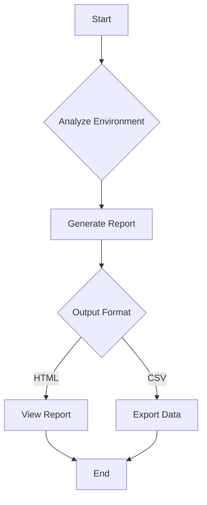

# Badges

# Enterprise-Grade Description
Veeam ASBuilt Unified is a comprehensive reporting tool designed to provide insight and audit capabilities for Veeam environments, helping enterprises to ensure compliance, optimization, and best practices.

# Overview
## Use Cases
- Assessing Veeam backup configurations
- Compliance audits
- Performance optimization

# Key Features
- Comprehensive reporting
- Easy integration with existing tools
- Customizable outputs
- User-friendly interface

# How It Works

# Requirements
## Operating System
- Windows 10 or later
- Windows Server 2016 or later

## PowerShell Modules
- Veeam PowerShell Module

## Access Requirements
- Administrator privileges

## Optional
- Internet access for updates

# Parameters
| Parameter Name | Description            | Type   | Required |
|----------------|------------------------|--------|----------|
| Destination     | Output file path      | String | Yes      |
| Format          | Output file format    | String | No       |

# Output Files
- Report.html
- Report.csv

# Report Contents
- Summary of backup jobs
- List of configured backup repositories

# Typical Use Cases
- Regular compliance checks
- Backup job performance assessments

# Limitations
- Requires PowerShell 5.1 or higher

# Troubleshooting
## Common Issues
- PowerShell module not found
- Insufficient permissions

## Resolutions
- Check module installation
- Run PowerShell as Administrator

# Example Output Files
- SampleReport.html
- SampleReport.csv

# Contribution Notes
We welcome contributions! Please follow the standard practices outlined in our contributing guide.

# Disclaimer
This tool is provided "as is" without warranty of any kind.

# License
MIT License

# Author
Julian Scunha